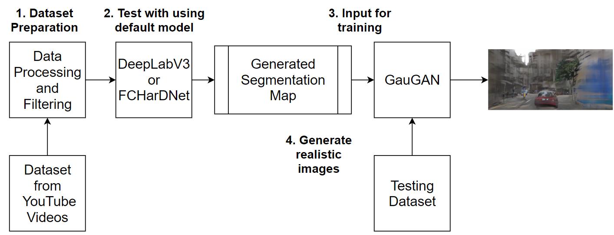

# Synthetic Hong Kong Urban Image Generation

This is the repository for the Final Project of HKUST COMP 4471 (Deep Learning with Computer Vision). The paper is also included in the repository and can be found [**here**](COMP4471_final_report.pdf).

# Project Score

    Average Score of three graders: (100 + 95 + 100) / 3 = 98.333%

# Team Members

## 1. Alvin HARJANTO
* Github: alvone01

## 2. Cheuk Hei CHONG
* Github: thomas-chong

## 3. Kai Lok LAM
* Github: kllamaf

# Introduction

This project aims to generate photorealistic urban landscape images of Hong Kong from labelled segmentation maps, which will be useful in industries that need landscape visualization such as urban planning. To achieve this, we will conduct experiments with state-of-the-art deep learning models such as DeepLab and GauGAN. Datasets for training will be collected from readily available sources on the internet, and results will be evaluated both qualitatively and quantitatively.

# Method
Our approach is divided into two parts, segmentation generation and retaining of GauGAN models. Unlike Cityscapes dataset that already includes well-classified segmentation maps for every image, therefore before training on the GauGAN models, in the first stage, we have to utilize some existing models to generate the segmentation map on our own. We decided to adopt two existing models for segmentation: DeeplabV3 and FCHarDNet. Both models are able to classify different objects in our datasets, especially detection on humans, vehicles, buildings, roads, road signs, plants and the sky. As different models may generate different segmentation results and error is unavoidable, after the getting result, we will compare both models and choose the best optimal one in a quantitative and qualitative way.

It is then moved to the second stage, synthetic image generation by GauGAN models. With the generated image segmentation map in the previous step, original images and segmentation maps will be fed into GauGAN models to train. After training, we can use the testing image segmentation map to generate realistic images. The general structure of our network is shown in the figure below:

